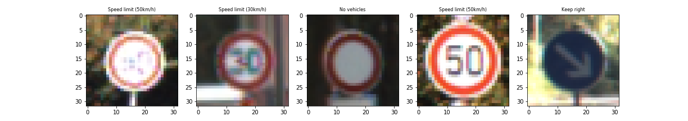
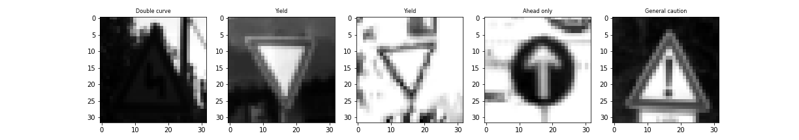
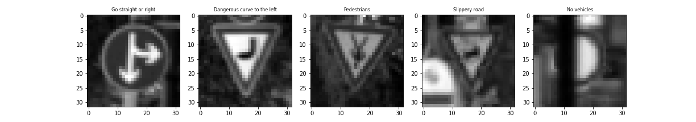
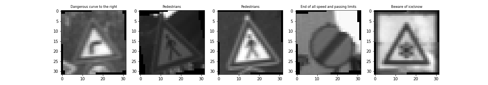
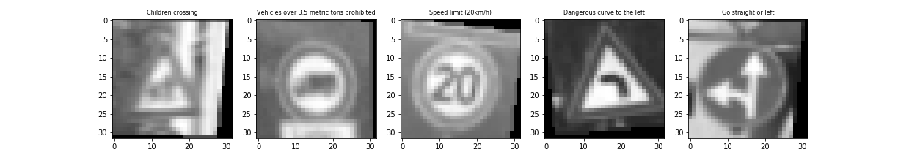
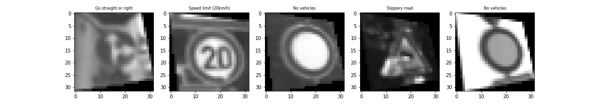

# **Traffic Sign Recognition**

## Project Writeup

---

**Build a Traffic Sign Recognition Project**

The goals / steps of this project are the following:
* Load the data set (see below for links to the project data set)
* Explore, summarize and visualize the data set
* Design, train and test a model architecture
* Use the model to make predictions on new images
* Analyze the softmax probabilities of the new images
* Summarize the results with a written report

---

### Data Set Summary & Exploration

I used the pandas library to calculate summary statistics of the traffic
signs data set:

#### 1. Basic summary of the data set

* Dataset archive **traffic-signs-data.zip** (exctracted to *traffic-signs-data/* directory)
* The size of training set is 34799
* The size of the validation set is 4410
* The size of test set is 12630
* The shape of a traffic sign image is (32, 32, 3)
* The number of unique classes/labels in the data set is 43

#### 2. Exploratory visualization of the dataset.

Here is an exploratory visualization of the data set presented as a bar chart showing distribution of the training data set. Each bar represents one traffic sign (a class) and number of samples in the class. The mapping of traffic sign names to classesis provided in file **signnames.csv**. *(Code cell [3])*

Below are some random examples of the traffic signs from the training dataset

### Design and Test a Model Architecture

#### 1. Describe how you preprocessed the image data. What techniques were chosen and why did you choose these techniques? Consider including images showing the output of each preprocessing technique. Pre-processing refers to techniques such as converting to grayscale, normalization, etc. (OPTIONAL: As described in the "Stand Out Suggestions" part of the rubric, if you generated additional data for training, describe why you decided to generate additional data, how you generated the data, and provide example images of the additional data. Then describe the characteristics of the augmented training set like number of images in the set, number of images for each class, etc.)

As a first step, I decided to convert the images to grayscale to exclude a color factor from the processing which makes the image analysis more effective. Grayscaling is done by simply averaging the color pixels: (R + G + B) / 3 ([source](https://www.johndcook.com/blog/2009/08/24/algorithms-convert-color-grayscale/)) *(Code cell [5])*

Here is an example of a traffic sign images after grayscaling.

As a last step, I normalized the image data because, as I learned in the course, it is mach easier for the model to leand when the model input data is normalized. At first I tried to use a simple normalization technique (X_train - 128)/128 learned in the lessons of Vincent Vanhoucke. Later I implemented Min-Max scaling to a range of [0.1, 0.9] from the TensorFlow lab which gave me better model training results.

I decided to generate additional data because, as pointed in [Goodfellow, Bengio, and Courville's book on Deep Learning](http://www.deeplearningbook.org/contents/regularization.html), "The best way to make a machine learning model generalize better is to train it on more data... One way to get around this problem is to create fake data and add it to the training set." That method is called "dataset augmentation". The same source states that "Dataset augmentation has been a particularly effective technique for a specific classification problem: object recognition" and also "operations, such as rotating the image or scaling the image, have also proved quite effective."

To add more data to the the data set, I used NumPy and Scikit toolboxes to do data augmentation: 
* Rotation
* Flip up/down direction
* Affine Transform
* Projective Transform

I generated about 20% images for each of the above transformations for each class and added it to the training dataset. *(Code cell [7, 8, 14])*.
Below are some examples of the augmented images.

Flipup:

Left rotation:

Right rotation:

Affine Transform:

Projective Transform:

#### 2. Describe what your final model architecture looks like including model type, layers, layer sizes, connectivity, etc.) Consider including a diagram and/or table describing the final model.

I started with classic [LeNet-5](http://yann.lecun.com/exdb/publis/pdf/lecun-98.pdf) architecture and experimented with different layers in order to get minimum 97% validation accuracy. I found that making the Flat layers wider give me better results. My final model consisted of the following layers:

| Layer         		|     Description	        					         | 
|:----------------------|:------------------------------------------------------:| 
|||
| Input         		| 32x32x1 Grayscaled image | 
|||
| Convolution 5x5     	| 1x1 stride, VALID padding, outputs 28x28x16 |
| RELU					|												         |
| Max pooling 2x2      	| 2x2 stride, VALID padding, outputs 14x14x16 |
|||
| Convolution 5x5	    | 1x1 stride, VALID padding, outputs 10x10x32      									         |
| RELU					|												         |
| Max pooling 2x2      	| 2x2 stride, VALID padding, outputs 5x5x32 |
||| 
| Flatten               | Outputs 800|
| Dropout               |Keep probability 0.75|
|||
| Fully connected		| Outputs 400        									         |
|RELU||
|Dropout|Keep probability 0.75|
|||
| Fully connected		| Outputs 120        									         |
|RELU||
|Dropout|Keep probability 0.75|
|||
| Fully connected		| Outputs 43        									         |
|						|												         |

#### 3. Describe how you trained your model. The discussion can include the type of optimizer, the batch size, number of epochs and any hyperparameters such as learning rate.

To train the model, I used the AdamOptimizer with a learning rate of 0.001. The number of epochs used was 40. The batch size was 150. 
I did not try different types of the optimizer. A change of the lerning rate did not give me better results. But I increased the batch size from from initial 128 for 150 to improve the accuracy. Also I increase the dropout keep probability from to 0.75. I found that the accuracy level was suturating at abote 40 epochs so I kept it at that level. 

#### 4. Describe the approach taken for finding a solution and getting the validation set accuracy to be at least 0.93. Include in the discussion the results on the training, validation and test sets and where in the code these were calculated. Your approach may have been an iterative process, in which case, outline the steps you took to get to the final solution and why you chose those steps. Perhaps your solution involved an already well known implementation or architecture. In this case, discuss why you think the architecture is suitable for the current problem.

My final model results were:
* training set accuracy of 100%
* validation set accuracy of 97.7%
* test set accuracy of 96.2%

If an iterative approach was chosen:

* What was the first architecture that was tried and why was it chosen?
    * *The firrst architecture was the original Lenet-5 from the lab. I ran it after simple pre-processing of the training dataset and get validation accuracy of about 93%.*  
* What were some problems with the initial architecture?
    * *The problem was quit low accuracy - I could not get more than 93-95% depending on the number of epochs I was running. My goal was to get at least 97%*  
* How was the architecture adjusted and why was it adjusted? Typical adjustments could include choosing a different model architecture, adding or taking away layers (pooling, dropout, convolution, etc), using an activation function or changing the activation function. One common justification for adjusting an architecture would be due to overfitting or underfitting. A high accuracy on the training set but low accuracy on the validation set indicates over fitting; a low accuracy on both sets indicates under fitting.
    * *First I added more data in the training dataset by doing data augmentation. I changed the normalization method to "min-max". I gave me additional 2% of accuracy. Then I added data dropouts in the flat layer and reached about 96-97%. The I tryed to modify the model architecture itself. I noticed that the model peforms better by expanding the flat layer (or, maybe, because of deeper convolutions). So I tested three models with different size of the flat layers. I also noticed that making the convolutions too deep affects the performance of the model - it runs too slow. So I made a trade off between the accuracy and performance and picked the medium size model (Lenet_2 - code cell [18]) as the final.*     
* Which parameters were tuned? How were they adjusted and why?
    * *The other parameters I adjusted were:*
        - Number of epochs
        - Dropout keep probability (increased to 0.75)
        - Data batch size (increased to 150)
        - I did not see much effect of changing the learning rate around the initial value of 0.001
* What are some of the important design choices and why were they chosen? For example, why might a convolution layer work well with this problem? How might a dropout layer help with creating a successful model?
    * *As I pointed above my problem was to find a compromise between the performance and the accuracy. Also the dropout helped to reduce (I don't believe it was completely solved) overfitting of the wide full-connected layers.* 

If a well known architecture was chosen:
* What architecture was chosen? - *Lenet-5 (modified)* 
* Why did you believe it would be relevant to the traffic sign application? - *Because it was choosen by Udacity in the related lessons :-). Also I beleive it is quit simple and performs well* 
* How does the final model's accuracy on the training, validation and test set provide evidence that the model is working well? - *Actually I did not try different architectures to compare. But it was able to classify at least 2 out of 5 random images I downloaded from web.*

### Test a Model on New Images

#### 1. Choose five German traffic signs found on the web and provide them in the report. For each image, discuss what quality or qualities might be difficult to classify.

Here are five German traffic signs that I found on the web:

![alt text][image4] ![alt text][image5] ![alt text][image6] 
![alt text][image7] ![alt text][image8]

The first image might be difficult to classify because ...

####2. Discuss the model's predictions on these new traffic signs and compare the results to predicting on the test set. At a minimum, discuss what the predictions were, the accuracy on these new predictions, and compare the accuracy to the accuracy on the test set (OPTIONAL: Discuss the results in more detail as described in the "Stand Out Suggestions" part of the rubric).

Here are the results of the prediction:

| Image			        |     Prediction	        					| 
|:---------------------:|:---------------------------------------------:| 
| Stop Sign      		| Stop sign   									| 
| U-turn     			| U-turn 										|
| Yield					| Yield											|
| 100 km/h	      		| Bumpy Road					 				|
| Slippery Road			| Slippery Road      							|

The model was able to correctly guess 4 of the 5 traffic signs, which gives an accuracy of 80%. This compares favorably to the accuracy on the test set of ...

####3. Describe how certain the model is when predicting on each of the five new images by looking at the softmax probabilities for each prediction. Provide the top 5 softmax probabilities for each image along with the sign type of each probability. (OPTIONAL: as described in the "Stand Out Suggestions" part of the rubric, visualizations can also be provided such as bar charts)

The code for making predictions on my final model is located in the 11th cell of the Ipython notebook.

For the first image, the model is relatively sure that this is a stop sign (probability of 0.6), and the image does contain a stop sign. The top five soft max probabilities were

| Probability         	|     Prediction	        					| 
|:---------------------:|:---------------------------------------------:| 
| .60         			| Stop sign   									| 
| .20     				| U-turn 										|
| .05					| Yield											|
| .04	      			| Bumpy Road					 				|
| .01				    | Slippery Road      							|

For the second image ...

### (Optional) Visualizing the Neural Network (See Step 4 of the Ipython notebook for more details)
####1. Discuss the visual output of your trained network's feature maps. What characteristics did the neural network use to make classifications?
